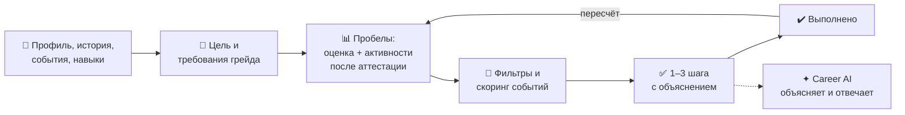
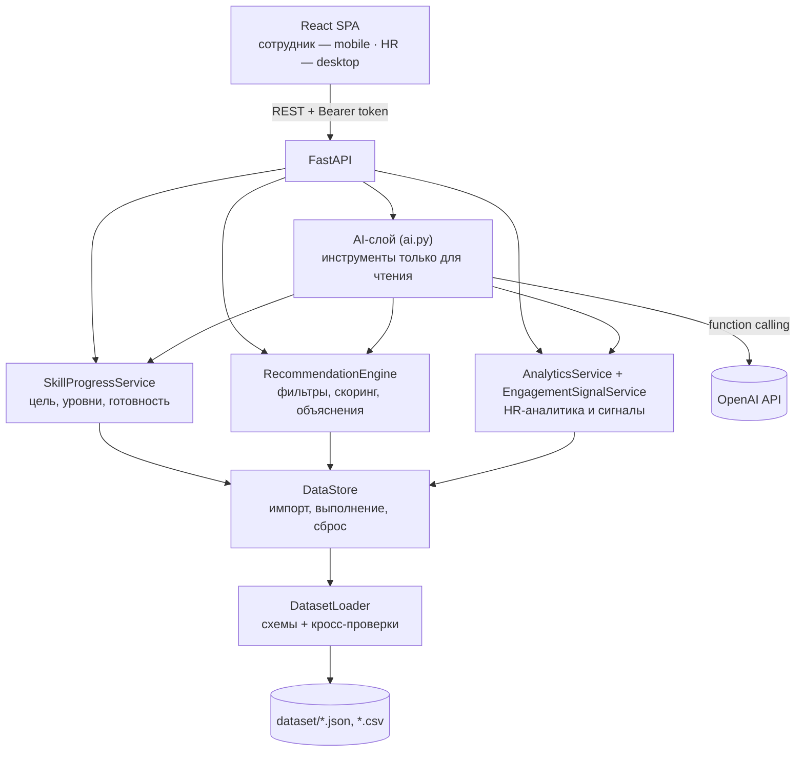

<div align="center">

# ✦ Career Quest

**AI-навигатор развития сотрудника: объяснимый следующий шаг вместо разрозненных HR-уведомлений**

HackAlem AI · трек Halyk Bank · кейс «Career Quest»


</div>

---

## 1. Проблема и для кого

Сотрудник получает поток обучений, аттестаций и дедлайнов, но не видит, **куда они ведут**, поэтому проходит их формально. HR тратит бюджет на развитие полностью, но не видит, **какие компетенции проседают и у кого нет следующего шага**.

**Career Quest** показывает сотруднику его траекторию и подбирает 1–3 шага с понятным обоснованием, а HR получает срез по навыкам, участию и пробелам каталога.

| Пользователь | Что получает |
|---|---|
| 👤 **Сотрудник** (стаж 1–5 лет) | Профиль и цель, готовность к следующему грейду, 1–3 рекомендации с объяснением, пересчёт прогресса после выполнения, чат Career AI |
| 🧭 **HR** | Проседающие навыки, участие по активностям, сотрудники без подходящего шага, пробелы каталога, поддерживающие сигналы, AI-инсайты, импорт данных |

## 2. Что реализовано

- **Профиль и траектория.** Роль, грейд, навыки, пройденные активности, цель (своя, «следующий грейд» или смена роли), готовность в % с формулой расчёта.
- **Рекомендации 1–3 шагов.** Детерминированный движок: фильтры допустимости, взвешенный скоринг, метки `Strong / Good match / Exploratory` без фиктивных вероятностей.
- **Объяснение по многим факторам.** Грейд и цель, разрыв по навыку с цифрами, критичность навыка, ожидаемый эффект, история участия (неявки, отказы, успешные прохождения), формат, нагрузка, ближайшая сессия. На русском, казахском или английском.
- **Честные «заблокированные» пробелы.** Если ни одна активность каталога не может закрыть критический навык, система прямо говорит об этом, а не подсовывает случайный курс.
- **Обновление прогресса.** «Отметить выполненным» → навыки, готовность и рекомендации пересчитываются сразу, экран «Что изменилось» показывает разницу.
- **Оценка ≠ сертификация.** Формальный уровень с последней аттестации хранится отдельно; активности меняют только расчётную оценку.
- **HR-панель.** KPI, тепловая карта «отдел × навык», топ пробелов, участие по активностям, воронка карьерного пайплайна, люди без следующего шага, пробелы каталога, поддерживающие сигналы («что знаем / чего не знаем / как поддержать»).
- **Career AI (OpenAI).** Чат сотрудника и AI-инсайты для HR. Модель только объясняет данные бэкенда и не принимает решений; без ключа работает по правилам.
- **Импорт данных жюри.** Загрузка `employees.json` / `activity_history.csv` (и `events.json` / `skills.json`) в формате датасета с проверкой и предпросмотром; новые профили работают сразу, без перезапуска.
- **Роли и приватность.** Сотрудник видит только себя; HR не видит чатов сотрудников; без рейтингов, стриков и баллов за обязательные процессы.

## 3. Как это работает



1. **Цель.** Берётся `career_goal` сотрудника; если её нет — следующий грейд в текущей роли.
2. **Прогресс.** `текущий уровень = оценка на аттестации + рост от активностей после неё`; `разрыв = max(требование − текущий уровень, 0)`.
3. **Фильтры.** Исключаются обязательные (они в отдельном блоке «Обязательно»), чужая аудитория, уже пройденные (кроме клуба EV_036), начатые, с невыполненными пререквизитами, не закрывающие разрыв, упёршиеся в `max_level`, без будущей сессии.
4. **Скоринг.** Вклад в критические навыки весит больше всего; учитываются полезный прирост, соответствие цели, позитивная история, **трения** (неявки/срывы/отказы на тех же и похожих активностях), формат, нагрузка, разнообразие шагов.
5. **Результат.** До 3 рекомендаций с числовыми факторами, ожидаемым эффектом и текстовым объяснением.

> Пример: у сотрудника самый низкий навык — Public Speaking, но он трижды пропускал Public Speaking Club, а для Senior критичен System Design. Система рекомендует **System Design** и объясняет почему — правило «бери минимальный навык» здесь бы ошиблось.

## 4. Технологии

| Слой | Стек |
|---|---|
| Бэкенд | Python 3.11+, FastAPI, Pydantic 2, Uvicorn, httpx |
| Фронтенд | React 19, TypeScript, Vite, Tailwind CSS, React Router |
| AI | OpenAI Chat Completions API с function calling, модель по умолчанию `gpt-4.1-mini` (настраивается) |
| Безопасность | Токены с подписью HMAC-SHA256, разделение ролей сотрудник / HR |
| Тесты | pytest, Vitest + Testing Library, Playwright (e2e) |
| Запуск | Docker, Docker Compose, Makefile |

## 5. Архитектура



- **Решения принимает детерминированный код**, а не LLM: все расчёты воспроизводимы и покрыты тестами.
- **AI-слой** вызывает инструменты, привязанные к вошедшему сотруднику: прогресс, рекомендации, альтернативы, симуляция «что будет, если пройду», история. Ответ, где упомянута активность не из данных, отбрасывается; при отсутствии ключа, ошибке или превышении 8 секунд работает ответ по правилам.
- **HR-AI** получает только обезличенные агрегаты; ответы с числами, которых нет в данных, отклоняются.
- **FastAPI отдаёт и API, и собранный фронтенд** — один контейнер, один порт.

## 6. Установка и запуск

**Вариант A — одна команда (Docker):**

```bash
git clone https://github.com/BAITC-Hacks/hack-53d6003c-arqau.git
cd hack-53d6003c-arqau
docker compose up --build
```

Откройте **http://localhost:8000** · документация API: http://localhost:8000/docs

**Вариант B — локально** (Python 3.11+, Node.js 22):

```bash
make install   # venv + npm-зависимости
make dev       # API на :8000, интерфейс на http://127.0.0.1:5173
make test      # тесты бэкенда и фронтенда
```

**Включить AI (необязательно).** Без ключа всё работает, Career AI отвечает по правилам. Чтобы подключить OpenAI:

- через интерфейс: войти как **HR** → **AI settings** → вставить ключ → **Save key** (ключ хранится только в памяти сервера и не возвращается API);
- или через файл: `cp .env.example .env` и указать `OPENAI_API_KEY=sk-...` перед запуском.

## 7. Как проверить (сценарий для жюри)

1. **Сотрудник.** На экране входа выберите сотрудника **E0028** (Backend Engineer, Middle).
   - **Главная:** готовность к Senior и предупреждение, что критический навык System Design не закрывается каталогом.
   - **События → «Почему?»:** факторы рекомендации с цифрами.
   - **«Отметить завершённым»:** окно «Что изменилось» — уровень навыка, готовность до/после, новые рекомендации.
2. **Career AI** (вкладка AI): «Почему я ещё не готов к цели?», «Что будет, если я пройду главную рекомендацию?». Над ответом виден режим: `✦ AI · gpt-4.1-mini` или «Ответ по правилам»; под ним — «Почему такой ответ?» с источниками.
3. **HR.** Выйдите и войдите как **HR partner**: Overview (KPI, тепловая карта), People (сигналы и «нет следующего шага»), Skills, Events, **AI settings → Generate insights**, строка **Ask AI**.
4. **Импорт профиля-ловушки.** HR → **Import data** → выберите оба файла из [`samples/jury_demo/`](samples/jury_demo) → **Dry-run preview** → **Import**. Выйдите и на экране входа найдите через поиск **E9001**: у него низкий Public Speaking и 3 неявки на Public Speaking Club, но первые рекомендации — по критическому **System Design** (EV_006, EV_007) с объяснением.
5. **Свои профили жюри** загружаются так же, в формате датасета. Для повторного прогона: перезапустите контейнер или вызовите `POST /admin/reset` под HR.

## 8. Данные и интеграции

- **Датасет кейса** (`dataset/`, синтетический): 200 сотрудников, 40 событий, 60 навыков, 8 ролей × 4 грейда, 2 743 записи истории за 24 месяца. «Сегодня» — дата снимка `2026-10-01`.
- **Дополнительные данные** в той же схеме: через экран Import, `POST /import` или переменную `CAREER_QUEST_EXTRA_DATA_DIR`.
- **Внешний сервис:** только OpenAI API, и только если задан ключ. Для чата сотрудника отправляются его собственные данные о навыках и рекомендациях (без имени), для HR — обезличенные агрегаты. Без ключа данные не покидают сервер.

## 9. Ограничения

- **Нет QR-подтверждения участия.** Выполнение отмечает сам сотрудник (API также принимает источник `hr_confirmed`).
- **Демо-вход без пароля и SSO.** Роль выбирается на экране входа.
- **Состояние в памяти.** Импорт и отметки о выполнении сбрасываются при перезапуске; базы данных нет.
- **Нет экрана руководителя** (Manager view).
- **Не моделируются** вместимость событий, листы ожидания и календарная запись.
- **Названия навыков и событий** — на английском, как в датасете; интерфейс и объяснения — на русском, казахском и английском.
- **AI требует ключа OpenAI;** без него — ответы по правилам из тех же данных.

## 10. Развёртывание и deployed-версия

**Публичной ссылки нет:** данные кейса не выносятся за пределы хакатона. При этом решение готово к развёртыванию на любом сервере с Docker:

- **Один контейнер.** Многоэтапный `Dockerfile` собирает фронтенд (Node 22) и запускает FastAPI (Python 3.12), который отдаёт и API, и интерфейс на порту **8000**. Отдельный веб-сервер не нужен.
- **Без базы данных и внешних зависимостей.** Датасет встроен в образ; `compose.yaml` может подменить его своим каталогом (монтируется только для чтения).
- **Конфигурация через переменные окружения** (шаблон — `.env.example`):

| Переменная | Назначение |
|---|---|
| `CAREER_QUEST_SECRET` | Ключ подписи токенов; для сервера задайте длинную случайную строку, иначе токены сбрасываются при перезапуске |
| `OPENAI_API_KEY`, `OPENAI_MODEL` | Включают Career AI (необязательно) |
| `CAREER_QUEST_DATA_DIR` | Каталог базового датасета |
| `CAREER_QUEST_EXTRA_DATA_DIR` | Каталог с дополнительными профилями, загружаемыми при старте |

```bash
docker build -t career-quest .
docker run -p 8000:8000 -e CAREER_QUEST_SECRET=<случайная-строка> -e OPENAI_API_KEY=<ключ> career-quest
```

- **Проверка работоспособности:** `GET /health` возвращает статус и число загруженных записей.
- **Для продакшена потребуется:** база данных вместо хранения в памяти, SSO вместо демо-входа, HTTPS и хранилище секретов (см. раздел 9).

---

<sub>Подробная техническая документация (эндпоинты, веса скоринга, пороги сигналов, импорт): [docs/TECHNICAL.md](docs/TECHNICAL.md)</sub>
